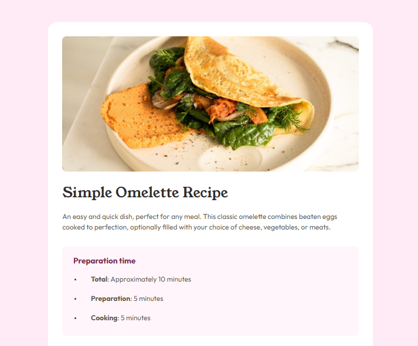

# Frontend Mentor - Recipe page solution

This is a solution to the [Recipe page challenge on Frontend Mentor](https://www.frontendmentor.io/challenges/recipe-page-KiTsR8QQKm). Frontend Mentor challenges help you improve your coding skills by building realistic projects.

## Table of contents

- [Overview](#overview)
  - [The challenge](#the-challenge)
  - [Screenshot](#screenshot)
  - [Links](#links)
- [My process](#my-process)
  - [Built with](#built-with)
  - [What I learned](#what-i-learned)
  - [Continued development](#continued-development)
- [Author](#author)
- [Acknowledgments](#acknowledgments)

## Overview

My attempt at solving the Recipe Page Challenge

### Screenshot

### Links

- [Solution URL](https://github.com/ibitoy3/Recipe-Page)
- [Live Site URL](https://ibitoy3.github.io/Recipe-Page/)

## My process

I Approached the design using a mobile-first workflow method, the HTML file was made to e as symantic as possible before any styling was done.

The styling of the page was done from the top down with keen attention on making the rendered webpage look as similar as possible to the given design.

### Built with

- Semantic HTML5 markup
- CSS custom properties
- Tables
- BEM
- Mobile-first workflow

### What I learned

I gained a more indept knowledge on semantic coding

### Continued development

I will endeavor to learn more about the uncommon (at least to me) element styling methods, for markers, tables and the likes

## Author

- Website - [Ibitoye Ayomide]
- Frontend Mentor - [@ibitoy3](https://www.frontendmentor.io/profile/ibitoy3)

## Acknowledgments

All the Glory belongs to Almighty God
